# Overseer

An Arduino Flood Detection System Robotics Project.

*"Better safe than sorry..."*

 

# Table of Contents

| Content |
| :--- |
| [Overseer](#overseer) |
| [Table of Contents](#table-of-contents) |
| [What Types of Problems is it Built to Solve](#what-types-of-problems-is-it-built-to-solve) |
| [How Does it Work, in a Hardware Perspective](#how-does-it-work-in-a-hardware-perspective) |
| [Flood Types](#flood-types) |
| [What is the Documented Workflow During the Development of this Project?](#what-is-the-documented-workflow-during-the-development-of-this-project) |
| [What Possible Design Improvements are in-Store in the Future?](#what-possible-design-improvements-are-in-store-in-the-future) |
| [Project Design Image Examples](#project-design-image-examples) |
| [Project Deployment Image Examples](#project-deployment-image-examples) |
| [Arduino Parts Used](#arduino-parts-used) |
| [Miscellaneous Materials Used](#miscellaneous-materials-used) |
| [Software Tools Used](#software-tools-used) |
| [Project Software API](#project-software-api) |
| [Buzzer](#buzzer) |
| [Connections](#connections) |
| [FloodDetectionSystemApplication](#flooddetectionsystemapplication) |
| [FloodLevels](#floodlevels) |
| [HCSR04UltrasonicDistanceCalculator](#hcsr04ultrasonicdistancecalculator) |
| [HCSR04UltrasonicDistanceSensor](#hcsr04ultrasonicdistancesensor) |
| [LightEmittingDiode](#lightemittingdiode) |
| [LiquidCrystalDisplay](#liquidcrystaldisplay) |
| [Utilities](#utilities) |
| [Team Members](#team-members) |
| [Organizations](#organizations) |
| [Additional References](#additional-references) |

 

# What Types of Problems is it Built to Solve?

1. To notify the public of nearby incoming floods within their vicinity.
2. To reduce the number of human flood-watchers in favor of omnipresent, disposable devices.
3. To provide additional situational awareness of the state of various bodies of water to mitigate further property damage.

 

# How Does it Work, in a Hardware Perspective?

1. The HCSR04 Ultrasonic Distance Sensor receives analog data and sends it to the Arduino Board.
2. The data is converted into the human-readable distance (in inches).
3. If the distance is above 12 inches, the Liquid Crystal Display (LCD) displays a “Safe” status, including the distance itself.
4. If the distance is 12 inches or less, the Liquid Crystal Display (LCD) displays a “Warning” status, including the distance itself.
5. If the “Warning” status has been displayed for 5 seconds continuously, the Liquid Crystal Display (LCD) will now display a “Danger” status; the Arduino Board will also emit both the Red Light-Emitting Diode (LED) and - Buzzer, indicating a detected flood.
6. If the current status resets to “Safe” the Red Light-Emitting Diode (LED) and Buzzer will stop emitting their respective outputs.

 

# Flood Types

These include every documented flood types used to classify different distance ranges.

| Image | Name | Distance (In Inches) | Description |
| :---: | :---: | :---: | :--- |
| 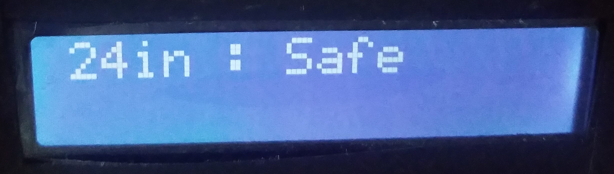</img> | Safe | distance > 12in | No flood detected |
| 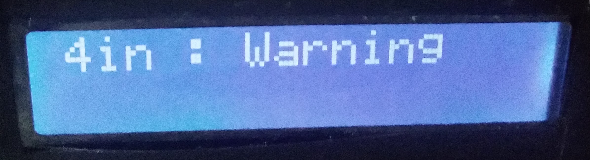</img> | Warning | distance <= 12in | A possible flood detected |
| 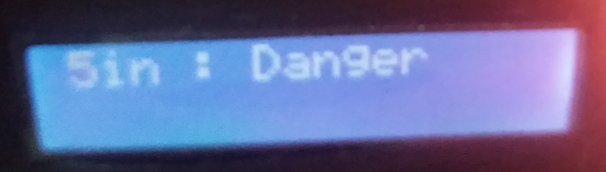</img> | Danger | distance <= 12in | Flood detected |

 

# What is the Documented Workflow During the Development of this Project?

These include a chronological order of every documented actions of every phase during the development of the project, from start to finish.

1. (4 Weeks before deployment) - The entire team brainstormed for a project idea and committed to the project design based on that idea.
2. (4 Weeks before deployment) - Due to a lack of practical experience during the project development, it had been decided to learn all the necessary skills on the job.
3. (3 Weeks before deployment) - The Arduino hardware system was developed, tested, emulated, and finalized.
4. (3 Weeks before deployment) - The Arduino software was developed, tested, and finalized.
5. (2 Weeks before deployment) - The 3d physical model of the project was developed and finalized.
6. (1 Week before deployment) - The needed materials to develop the physical model of the project were purchased and gathered. At least 1,000 Philippine Pesos were spent (excluding Arduino parts provided by the project instructor, Sir Michael Anthony Jay B. Regis).
7. (1 Week before deployment) - The 3d physical model was implemented, tested, and finalized its hardware systems.
8. (1 Week before deployment) - The infographic illustration of the project had been designed and finalized.
9. (During deployment) - The project was complete, displayed in the Visayas State University Robotics Booth, and pitched to the public.

 

# What Possible Design Improvements are in-Store in the Future?

| Name | Description |
| :--- | :--- |
| An Official, Adaptable, Waterproof Design | To increase the life span of Overseer devices by possible years and help them better survive various environments. |
| Mobile App Integration | To extend the range of notifications outside the limitations of a single town but through any subscribed listening electronic devices across the globe. |
| Solar Energy Systems | To provide each Overseer device with its power source and to reduce energy costs to manage each device. |
| Trigger-Middleman-Client System | To prevent false alarms from occurring through a human mediator before declaring a flood alarm towards listening subscribers. |

 

# Project Design Image Examples

| Image | Name |
| :--- | :--- |
| 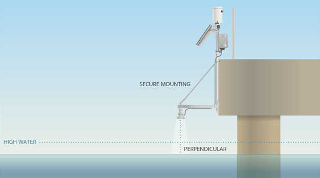</img> | A real-world, flood detection system device. |
| 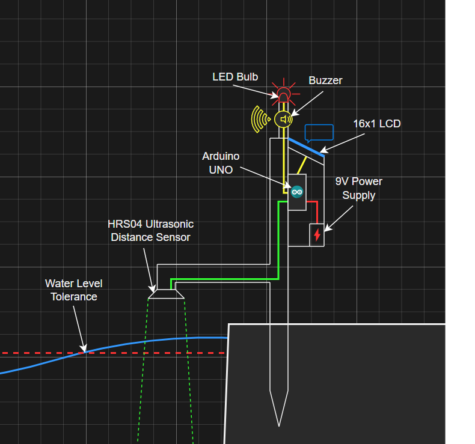</img> | A 2d concept design of the project, including its hardware systems. |
| 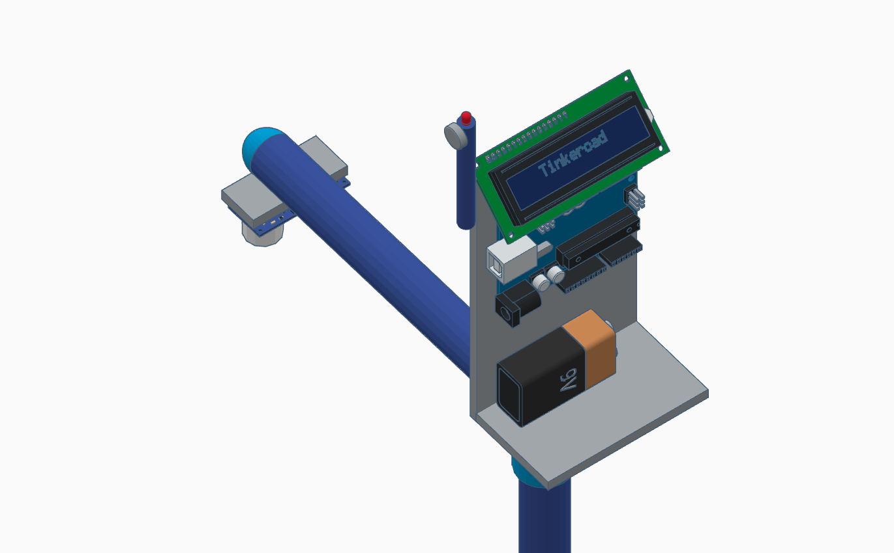</img> | A deprecated 3d model of the project. |

 

# Project Deployment Image Examples

| Image | Name |
| :--- | :--- |
| </img> | An overhead photo of the project including all intact Arduino parts. |
| </img> | A top-front photo of the project.  |
| </img> | A front-facing photo of the project, exposing its Liquid Crystal Display (LCD), Red Light-Emitting Diode (LED) and Buzzer. |
| 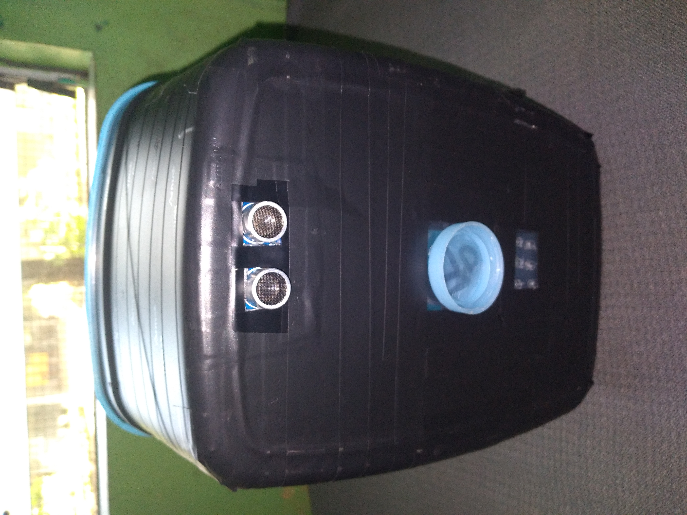</img> | An under photo of the project, exposing its HCSR04 Ultrasonic Distance Sensor. |

 

# Arduino Parts Used

These include every documented Arduino part used to build the physical design of the project.

| Image | Quantity | Name | Description |
| :---: | :---: | :--- | :--- |
| 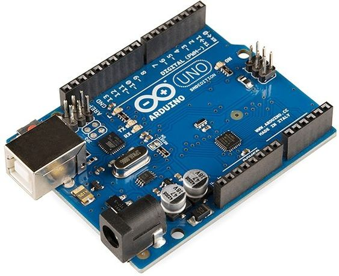</img> | 1x | Arduino UNO Board | Manages the processes of the Arduino project and its various connected Arduino parts. |
| 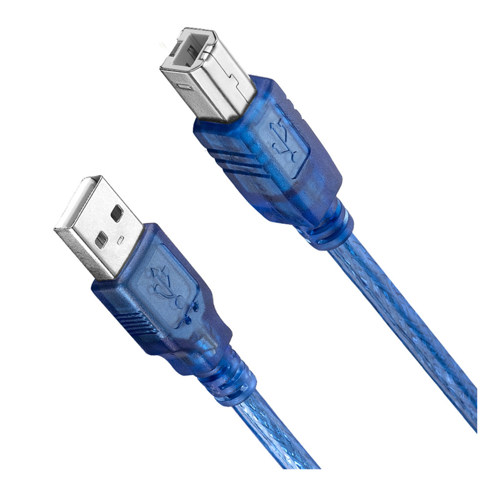</img> | 1x | Arduino USB Cable | Connects a power source to the Arduino UNO Board and sends Arduino programs from a computer to the Arduino Board. |
| 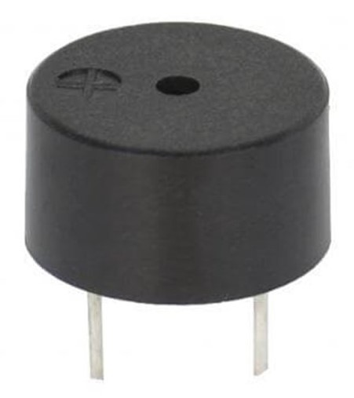</img> | 1x | Arduino Buzzer | Generates a sound whenever the flood status is set to "Danger". |
| 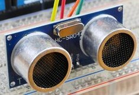</img> | 1x | Arduino HCSR04 Ultrasonic Distance Sensor | Receives analog data between the sensor itself from a solid or liquid surface. |
| 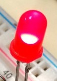</img> | 1x | Arduino Red Light-Emitting Diode (LED) | Generates red lighting whenever the flood status is set to "Danger". |
| 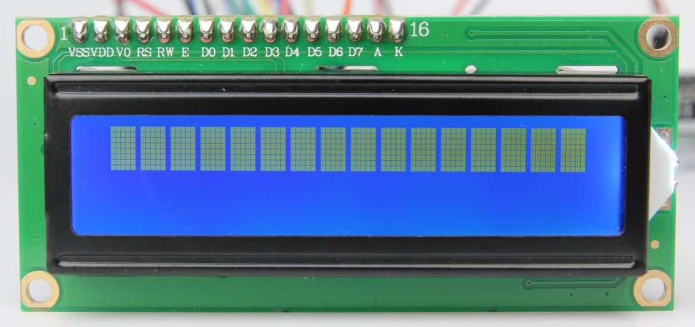</img> | 1x | Arduino 16x1 Liquid Crystal Display (LCD) | Displays the distance (in inches) and the current flood status. |

 

# Miscellaneous Materials Used

These include every documented miscellaneous materials used to build the physical design of the project.

| Quantity | Name |
| :---: | :--- |
| 1x | Black, Non-permanent Marker |
| 1x | Electric Tape |
| 1x | Electric Drill |
| 1x | Glue Gun |
| 1x | Glue Stick |
| 1x | Laptop |
| 1x | Plastic Cutter |
| 1x | 16x8x8 inch Plastic Box |
| 1x | Rapoo S2002 20,000 mAh Power Bank |
| 1x | 12-inch Ruler |

 

# Software Tools Used

These include every documented software tools used to build each respective field of the project.

| Image | Name | Purpose |
| :---: | :---: | :--- |
| </img> | [Arduino IDE](https://www.arduino.cc/en/software) | Arduino Software Development |
| </img> | [Canva.com](https://www.canva.com/) | Illustration Design |
| </img> | [Diagrams.net](https://app.diagrams.net/) | UML Class Design, 3d Physical Model Design |
| </img> | [Git](https://git-scm.com/) | Version Control System |
| </img> | [GitHub.com](https://github.com/) | Git Project Repository Host |
| </img> | [Krita](https://krita.org/) | Photo Editing |
| </img> | [Microsoft Word](https://www.microsoft.com/en-us/microsoft-365/word?activetab=tabs%3afaqheaderregion3) | Note Taking |
| </img> | [Visual Studio Code](https://code.visualstudio.com/) | Arduino Software Development, Documentation Editor |
| </img> | [Wokwi.com](https://wokwi.com/) | Arduino Hardware Emulator |

 

# Project Software API

An Object-oriented programming approach to software development has been implemented in order to anticipate multiple uses of similar Arduino parts.

## Buzzer

| Return Type | Method Name |
| :--- | :--- |
|  | Buzzer(byte pinNumber, unsigned short toneInHertz, unsigned long durationInMilliseconds) |
|  | Buzzer(byte pinNumber, unsigned short toneInHertz) |
|  | Buzzer(byte pinNumber) |
| byte | getPinNumber() |
| bool | getCurrentState() |
| unsigned short | getToneInHertz() |
| unsigned long | getDurationInMilliseconds() |
| void | turnOn() |
| void | turnOn(unsigned short toneInHertz) |
| void | turnOff() |
| void | blink() |
| void | blink(unsigned short toneInHertz) |
| void | blink(unsigned short toneInHertz, unsigned long durationInMilliseconds) |

 

## Connections

| Return Type | Method Name |
| :--- | :--- |
|  | Connections(unsigned int serialBandwidth) |
| unsigned int | getSerialBandwidth() |

 

## FloodDetectionSystemApplication

| Type Name | Attribute Name |
| :--- | :--- |
| const Utilities | utilities |
| const unsigned int | SERIAL_BANDWIDTH |
| const Connections | connections |
| const byte | MEASUREMENT_IN_INCHES |
| const unsigned int | SAFE_LEVEL_TOLERANCE_IN_INCHES |
| const HCSR04UltrasonicDistanceCalculator | hcsr04UltrasonicDistanceCalculator |
| unsigned int | currentNotWithinSafeDistanceCount |
| unsigned int | maximumNotWithinSafeDistanceCount |
| const byte | HCSR04_ULTRASONIC_DISTANCE_SENSOR_TRIGGER_PIN |
| const byte | HCSR04_ULTRASONIC_DISTANCE_SENSOR_ECHO_PIN |
| const HCSR04UltrasonicDistanceSensor | hcsr04UltrasonicDistanceSensor |
| const FloodLevels | floodLevels |
| const byte | DANGER_LEVEL |
| const byte | PENDING_LEVEL |
| const byte | SAFE_LEVEL |
| const byte | FIRST_LIGHT_EMITTING_DIODE_PIN |
| const unsigned long | OUTPUT_REFRESH_DELAY_IN_MILLISECONDS |
| const LightEmittingDiode | LightEmittingDiodes[1] |
| const byte | FIRST_BUZZER_PIN |
| const unsigned short | BUZZER_TONE_IN_HERTZ |
| const Buzzer | Buzzers[1] |
| const byte | COMMAND_OR_DATA_SELECT_PIN |
| const byte | ENABLE_PIN |
| const byte | PARALLEL_DATA_4_PIN |
| const byte | PARALLEL_DATA_5_PIN |
| const byte | PARALLEL_DATA_6_PIN |
| const byte | PARALLEL_DATA_7_PIN |
| const byte | ROW_COUNT |
| const byte | COLUMN_COUNT |
| const LiquidCrystalDisplay | liquidCrystalDisplay |
| unsigned long | lcdTimestampInMilliseconds |
| const unsigned long | LOOP_DELAY_IN_MILLISECONDS |
| unsigned long | loopTimestampInMilliseconds |
| unsigned int | savedDistance |

| Type Name | Method Name |
| :--- | :--- |
| bool | hasCrossedTheSafeDistanceThreshold(unsigned int distance) |
| bool | isDistanceWithinPendingLevel(unsigned int distance) |
| bool | isDistanceWithinDangerLevel(unsigned int distance) |
| unsigned int | getHcsr04UltrasonicDistanceSensorDistance() |
| byte | getCurrentFloodLevel(unsigned int distance) |
| void | triggerLightEmittingDiodesAndBuzzers(unsigned int distance) |
| bool | hasLoopDelayBeenReached(unsigned long newTimestampInMilliseconds, unsigned int oldTimestampInMilliseconds) |
| bool | hasOutputRefreshDelayBeenReached(unsigned long newTimestampInMilliseconds, unsigned int oldTimestampInMilliseconds) |
| unsigned int | handleCurrentNotWithinSafeDistanceCount(unsigned long currentTimeSinceArduinoInitializationInMilliseconds, unsigned int distance) |
| void | displayDistanceToLCD(unsigned int distance) |
| void | runFloodDetectionSystemApplication() |

 

## FloodLevels

| Return Type | Method Name |
| :--- | :--- |
| char* | getLevelName(byte index) |
| int | getLevelNameSize(byte index) |

 

## HCSR04UltrasonicDistanceCalculator

| Return Type | Method Name |
| :--- | :--- |
|  | HCSR04UltrasonicDistanceCalculator(unsigned int maximumDistance, byte measurementIndex) |
|  | HCSR04UltrasonicDistanceCalculator(unsigned int maximumDistance) |
|  | HCSR04UltrasonicDistanceCalculator(byte measurementIndex) |
| unsigned int | getIntegerConversion(unsigned int analogInput) |
| unsigned int | getMaximumDistance() |
| byte | getMeasurementIndex() |
| char  | *getMeasurementName() |
| int | getMeasurementNameSize() |

 

## HCSR04UltrasonicDistanceSensor

| Return Type | Method Name |
| :--- | :--- |
|  | HCSR04UltrasonicDistanceSensor(byte triggerPinNumber, byte echoPinNumber, unsigned int receptionDelayInMicroseconds) |
|  | HCSR04UltrasonicDistanceSensor(byte triggerPinNumber, byte echoPinNumber) |
| unsigned int | getReceptionDelayInMicroseconds() |
| byte | getTriggerPinNumber() |
| byte | getEchoPinNumber() |
| unsigned int | getAnalogInput() |

 

## LightEmittingDiode

| Return Type | Method Name |
| :--- | :--- |
|  | LightEmittingDiode(byte pinNumber) |
|  | LightEmittingDiode(byte pinNumber, unsigned long durationInMilliseconds) |
| byte | getPinNumber() |
| bool | getCurrentState() |
| unsigned long | getDurationInMilliseconds() |
| void | turnOn() |
| void | turnOff() |
| void | blink() |
| void | blink(unsigned long durationInMilliseconds) |

 

## LiquidCrystalDisplay

| Return Type | Method Name |
| :--- | :--- |
|  | LiquidCrystalDisplay(byte commandOrDataSelectPin, byte enablePin, byte parallelData4Pin, byte parallelData5Pin, byte parallelData6Pin, byte parallelData7Pin, byte maximumCellRows, byte maximumCellColumns) |
| byte | getCommandOrDataSelectPin() |
| byte | getEnablePin() |
| byte | getParallelData4Pin() |
| byte | getParallelData5Pin() |
| byte | getParallelData6Pin() |
| byte | getParallelData7Pin() |
| byte | getMaximumCellRows() |
| byte | getMaximumCellColumns() |
| byte | getCurrentCustomCharacterCount() |
| byte | getMaximumCustomCharacterCount() |
| void | displayTextAtCoordinates(char text[], byte rowDisplayCoordinate, byte columnDisplayCoordinate) |
| void | displayTextAtCoordinates(char text[], byte columnDisplayCoordinate) |
| void | clearDisplay(byte cellRowIndex, byte startingCellColumnIndex, byte endingCellColumnIndex) |
| void | clearDisplay(byte cellRowIndex, byte startingCellColumnIndex) |
| void | clearDisplay(bool condition) |
| void | clearDisplay() |
| void | addCustomCharacter(byte customCharacter[]) |

 

## Utilities

| Return Type | Method Name |
| :--- | :--- |
| unsigned int | getDigitSum(int number) |

 

# Team Members

These include every documented memeber involved during the development of this project.

| Name | Contributions | Hyperlink(s) |
| :--- | :--- | :--- |
| Elgin Ray Isaac Espanto | Project Adviser | [Facebook](https://www.facebook.com/gin0762), [GitHub](https://github.com/elginray), [Gmail](elginespanto@gmail.com) |
| John Rhuel Laurente | Craftsman | [Facebook](https://www.facebook.com/johnrhuel.laurente) |
| Juvilyn Pillatura Manuales | Prototype Developer | [Facebook](https://www.facebook.com/juvilyn.manuales) |
| Kyle Anthony Nierras | Project Adviser | [Facebook](https://www.facebook.com/Kaelord24) |
| Mariella Passamonte | Project Adviser | [Facebook](https://www.facebook.com/mariella.pasamonte) |
| Michael Anthony Jay B. Regis | Project Instructor, Arduino Hardware Supplier | [Facebook](https://www.facebook.com/michaelanthonyjay.regis) |
| Rogelio Suazo Herbolingo | Prototype Developer | [Facebook](https://www.facebook.com/rogeliosherbolingo) |
| Vaughn Cedric Lipardo Araneta | Documentation Writer, Fundraiser, Hardware Prototype Developer, Infographic Illustrator, Pitcher, Software Developer | [Facebook](https://www.facebook.com/people/Vaughn-Cedric-Araneta/100009443278525/), [GitHub](https://github.com/CedricDeVon), [Gmail](vaughncedriclipardoaraneta@gmail.com) |

 

# Organizations

These include every documented organization involved during the development of this project.

| Icon | Name | Hyperlink(s) |
| :--- | :--- | :--- |
| </img> | Visayas State University - Main Branch | [Facebook](https://www.facebook.com/visayasstateu/), [Homepage](https://www.vsu.edu.ph/) |
| </img> | Visayas State University - College of Engineering and Technology | [Facebook](https://www.facebook.com/VSUCETmain/), [Homepage](https://cet.vsu.edu.ph/) |
| 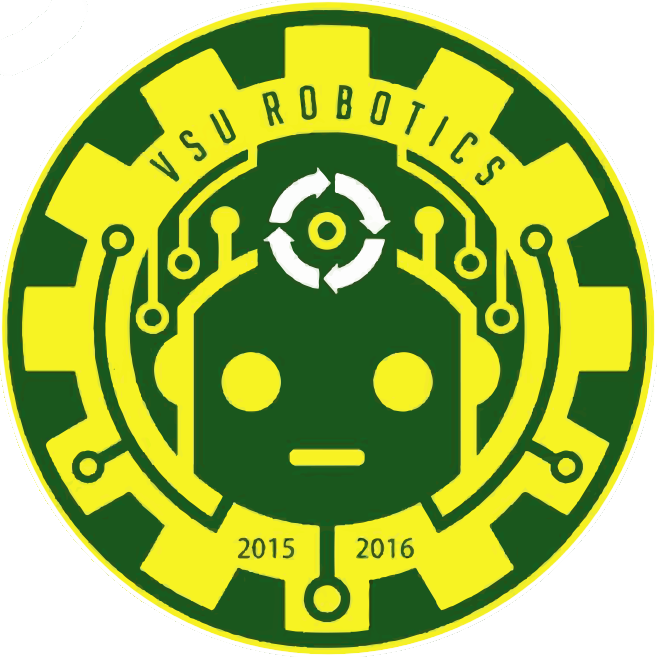</img> | Visayas State University - Robotics Organization | [Facebook](https://www.facebook.com/robotics.vsu) |

 

# Additional References
- [Arduino - Official Arduino Documentations](https://docs.arduino.cc/)
- [Electrical Technology - Early Flood Detection System Using Arduino – Source Code](https://www.electricaltechnology.org/2021/03/early-flood-detection-system.html/amp)
- [GitHub - Proteus Library GitHub Repository](https://github.com/Proteus-LIBRARY/Arduino-Library)
- [Hackster.io - How to build Arduino Water Detector Alarm](https://www.hackster.io/sarful/how-to-build-arduino-water-detector-alarm-c53c0b)
- [Project - Diagrams](./documentation/diagrams.drawio)
- [Project - Images](./documentation/images/)
- [Project - Final Infographic Illustration](./documentation/illustrations/final-infographic-illustration.pdf)
- [Project - 3d Models](./documentation/3d-models/)
- [YouTube - IOT Early Flood Detection](https://www.youtube.com/watch?v=L70MncRxUyg&ab_channel=projectsfactory)
